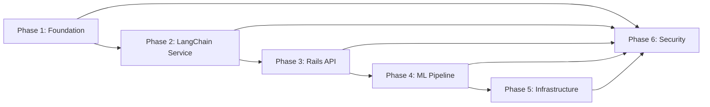

# BMO Learning Platform - Master Workplan

## Project Overview
**Goal**: Create a production-ready microlearning platform demonstrating LangChain best practices
**Purpose**:
1. Demonstrate deep LangChain understanding for potential clients
2. Create viable prototype for BMO or similar enterprise clients
3. Serve as reference implementation for LangChain in production

**Key Differentiators**:
- Enterprise-grade security and compliance
- Production-ready infrastructure (IaC)
- LLM safety and content moderation
- Comprehensive testing and monitoring
- Agent-optimized implementation approach

## Success Criteria
- [ ] Demonstrates 10+ LangChain patterns (RAG, agents, chains, memory, tools)
- [ ] Includes LLM safety guardrails (Constitutional AI, content filtering)
- [ ] Fully containerized with Docker Compose for local development
- [ ] Infrastructure as Code (Terraform) for AWS deployment
- [ ] 80%+ test coverage across services
- [ ] Security scanning integrated into CI/CD
- [ ] API documentation (OpenAPI/Swagger)
- [ ] Performance benchmarks documented

## Phase Overview

### Phase 1: Foundation & Setup (Week 1)
**Duration**: 3-5 days
**Deliverable**: Scaffolded project with configs, Docker setup, and documentation

See: [workplans/01-foundation-setup.md](./01-foundation-setup.md)

- [ ] Project structure and dependency management
- [ ] Docker Compose environment
- [ ] Development tooling (linting, formatting, pre-commit hooks)
- [ ] CI/CD pipeline skeleton
- [ ] Security baseline configuration

### Phase 2: LangChain AI Service (Week 2-3)
**Duration**: 10-14 days
**Deliverable**: Python service with RAG, agents, and content generation

See: [workplans/02-langchain-service.md](./02-langchain-service.md)

- [ ] Document ingestion and vector store
- [ ] RAG implementation with multiple retrieval strategies
- [ ] Adaptive learning agent system
- [ ] Content generation pipeline
- [ ] LLM safety layer (Constitutional AI, content moderation)
- [ ] Comprehensive testing

### Phase 3: Rails API Service (Week 4)
**Duration**: 7-10 days
**Deliverable**: Rails API with business logic and AI integration

See: [workplans/03-rails-api.md](./03-rails-api.md)

- [ ] Domain models and database schema
- [ ] Functional service layer
- [ ] Python service integration
- [ ] Multi-channel delivery (Slack, SMS, Email)
- [ ] Background job processing
- [ ] API endpoints and authentication

### Phase 4: ML Pipeline & Analytics (Week 5)
**Duration**: 5-7 days
**Deliverable**: Engagement predictor and analytics dashboard

See: [workplans/04-ml-analytics.md](./04-ml-analytics.md)

- [ ] XGBoost engagement predictor
- [ ] Risk classification model
- [ ] Model training pipeline
- [ ] Analytics dashboard
- [ ] A/B testing framework

### Phase 5: Infrastructure & Deployment (Week 6)
**Duration**: 5-7 days
**Deliverable**: Production-ready AWS infrastructure

See: [workplans/05-infrastructure.md](./05-infrastructure.md)

- [ ] Terraform modules for all AWS services
- [ ] Multi-environment setup (dev, staging, prod)
- [ ] Monitoring and observability
- [ ] Cost optimization
- [ ] Disaster recovery planning

### Phase 6: Security & Compliance (Continuous)
**Duration**: Ongoing
**Deliverable**: Security hardening and compliance documentation

See: [workplans/06-security-compliance.md](./06-security-compliance.md)

- [ ] LLM prompt injection protection
- [ ] PII detection and redaction
- [ ] Security scanning (SAST, DAST, SCA)
- [ ] Compliance documentation (SOC2, GDPR considerations)
- [ ] Penetration testing

## Critical Path

**Dependencies**:
- Phase 2 requires Phase 1 complete (Docker, configs)
- Phase 3 requires Phase 2 core components (AI service running)
- Phase 4 can run parallel to Phase 3 (separate concerns)
- Phase 5 requires Phase 2-4 (deploying working services)
- Phase 6 runs continuously alongside all phases

## Agent Execution Guidelines

### For Coding Agents
This workplan is optimized for agent execution with these principles:

**✅ DO**:
- Start each session by reading the current phase workplan
- Check off items as completed (update markdown)
- Run tests after each significant implementation
- Commit working code incrementally
- Update documentation alongside code
- Flag blocking issues immediately

**❌ DON'T**:
- Skip tests to move faster
- Implement features not in current phase
- Leave TODO comments instead of implementing
- Commit commented-out code
- Defer documentation to end

### Handoff Protocol
When switching between agents or sessions:

1. **Read current state**: Check latest phase workplan
2. **Review last commits**: Understand what was just completed
3. **Check tests**: Ensure green before continuing
4. **Pick next unchecked item**: Follow sequential order unless blocked
5. **Update workplan**: Check off completed items

### Testing Requirements
Every implementation must include:
- [ ] Unit tests (80%+ coverage)
- [ ] Integration tests for APIs
- [ ] End-to-end tests for critical paths
- [ ] Security tests (input validation, auth)
- [ ] Performance benchmarks where applicable

### Documentation Requirements
Every component must have:
- [ ] README with setup instructions
- [ ] API documentation (for services)
- [ ] Architecture decision records (ADRs) for key choices
- [ ] Inline code documentation (docstrings)
- [ ] Example usage

## Risk Management

### Technical Risks
| Risk | Mitigation | Owner |
|------|-----------|-------|
| LangChain version incompatibility | Pin versions, test upgrades in isolation | Phase 2 |
| LLM API costs during development | Use caching aggressively, local models for testing | Phase 2 |
| Vector store performance at scale | Benchmark early, plan for partitioning | Phase 2 |
| Rails/Python integration complexity | Build robust error handling, circuit breakers | Phase 3 |
| AWS cost overruns | Implement cost monitoring, auto-shutdowns | Phase 5 |

### Security Risks
| Risk | Mitigation | Owner |
|------|-----------|-------|
| Prompt injection attacks | Constitutional AI, input sanitization | Phase 6 |
| PII leakage in logs/embeddings | PII detection, log scrubbing | Phase 6 |
| API authentication bypass | OAuth2, rate limiting, audit logs | Phase 3 |
| Dependency vulnerabilities | Automated scanning, regular updates | Phase 1 |
| Data exfiltration via LLM | Output filtering, sensitive data tagging | Phase 6 |

## Definition of Done

### Feature-Level
- [ ] Code implemented and peer-reviewed
- [ ] Tests passing (unit, integration, E2E)
- [ ] Documentation updated
- [ ] Security scan passed
- [ ] Performance benchmark met
- [ ] Deployed to dev environment
- [ ] Checkbox marked in workplan

### Phase-Level
- [ ] All phase checklist items complete
- [ ] Integration tests with other phases passing
- [ ] Security review completed
- [ ] Documentation comprehensive
- [ ] Demo-ready
- [ ] Tagged release created

### Project-Level
- [ ] All 6 phases complete
- [ ] End-to-end system test passing
- [ ] Security audit passed
- [ ] Performance benchmarks met
- [ ] Documentation complete (README, architecture, API docs)
- [ ] Deployment runbook created
- [ ] Cost analysis documented
- [ ] Client demo prepared

## Metrics & KPIs

### Development Metrics
- **Velocity**: Features completed per week
- **Quality**: Test coverage %, bug density
- **Technical Debt**: TODO/FIXME count, code quality scores

### System Metrics
- **Performance**: API response times, LLM latency
- **Reliability**: Uptime %, error rates
- **Cost**: AWS spend per learner, LLM API costs

### Learning Metrics
- **Engagement**: Completion rates, response times
- **Effectiveness**: Quiz scores, knowledge retention
- **Satisfaction**: User feedback scores

## Communication Plan

### Status Updates
- **Daily**: Update workplan checkboxes, commit progress
- **Weekly**: Review phase progress, adjust timeline
- **Phase Completion**: Demo to stakeholders, retrospective

### Escalation Path
- **Blocking Issues**: Flag in workplan, document in ADR
- **Scope Changes**: Update affected phase workplans
- **Security Issues**: Immediate halt, document in security log

## Resources

### External Dependencies
- [ ] OpenAI API key (for embeddings, GPT-4)
- [ ] AWS account (for infrastructure)
- [ ] Twilio account (for SMS)
- [ ] Slack workspace (for testing delivery)
- [ ] GitHub account (for CI/CD)

### Development Tools
- [ ] Python 3.11+
- [ ] Ruby 3.2+
- [ ] Docker Desktop
- [ ] Terraform
- [ ] PostgreSQL (with pgvector)
- [ ] Redis

### Learning Resources
- [LangChain Documentation](https://python.langchain.com/)
- [Constitutional AI Paper](https://arxiv.org/abs/2212.08073)
- [RAG Best Practices](https://docs.anthropic.com/claude/docs/rag)
- [AWS Well-Architected Framework](https://aws.amazon.com/architecture/well-architected/)

## Next Steps

**Immediate Actions**:
1. ✅ Read this master workplan
2. ⏭️ Proceed to [Phase 1: Foundation & Setup](./01-foundation-setup.md)
3. Set up development environment
4. Create project scaffold
5. Begin implementation

**Decision Points**:
- After Phase 2: Validate LangChain approach with demo
- After Phase 4: Review cost projections before AWS deployment
- After Phase 5: Go/no-go decision for production launch

---

**Last Updated**: 2025-11-15
**Version**: 1.0
**Status**: Ready to Begin
